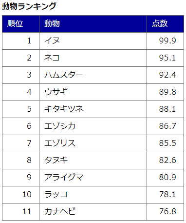
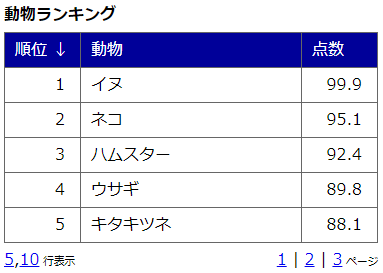
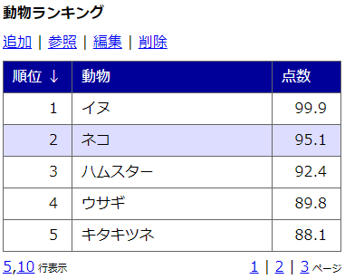
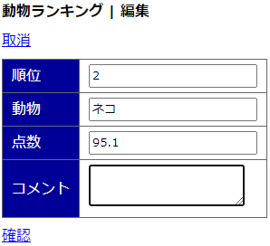
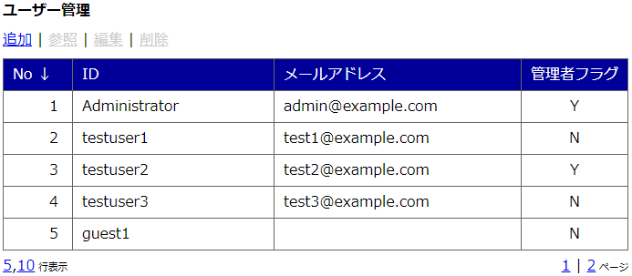
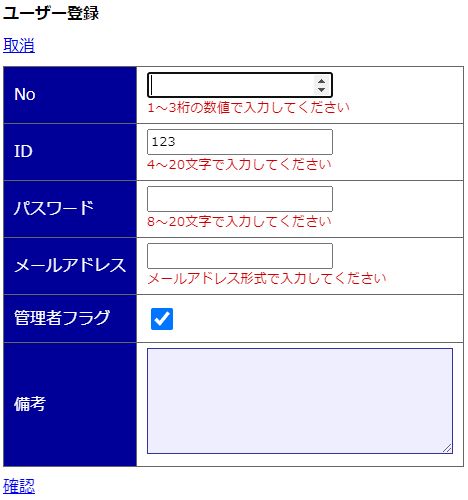
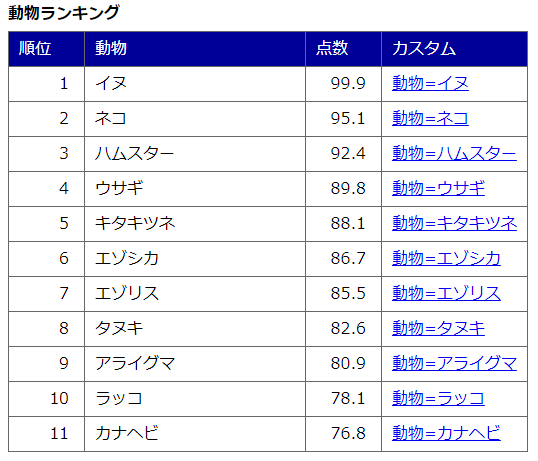

# miu.table.js
CRUD機能を持つテーブル生成JavaScriptライブラリです。 
依存性がないため各プロジェクトで使いやすいかと思います。

## Running
miu.table.jsをインクルード、JSON型プロパティをセット、JSON型データをセットするとテーブルが表示されます。

## Configurations
HTML & JS:
~~~
<head>

<!-- 1. include -->

</head>
<body>

</body>
~~~

## Cases
シンプルなケースからCRUDを実現するケースのサンプルです。

### sample1.html
シンプルなテーブル表示。 

~~~
    let tbl = new miu.table('myTable');
    tbl.set({
        'title' : '動物ランキング',
        'names' : ['順位','動物','点数'],
        'keys'  : ['number','animal','points'],
        'types' : ['number','text','number']
    });
    tbl.init([
        {'number':1,'animal':'イヌ','points':99.9},
        {'number':2,'animal':'ネコ','points':95.1},
        {'number':3,'animal':'ハムスター','points':92.4},
        {'number':4,'animal':'ウサギ','points':89.8},
        {'number':5,'animal':'キタキツネ','points':88.1},
        {'number':6,'animal':'エゾシカ','points':86.7},
        {'number':7,'animal':'エゾリス','points':85.5},
        {'number':8,'animal':'タヌキ','points':82.6},
        {'number':9,'animal':'アライグマ','points':80.9},
        {'number':10,'animal':'ラッコ','points':78.1},
        {'number':11,'animal':'カナヘビ','points':76.8}
    ]);
~~~

### sample2.html
ソートとページングを有効にしたテーブル表示。 

~~~
    let tbl = new miu.table('myTable');
    tbl.set({
        'title' : '動物ランキング',
        'names' : ['順位','動物','点数'],
        'keys'  : ['number','animal','points'],
        'types' : ['number','text','number'],
        'psize' : [5,10],
        'rdiv'  : ',',
        'runit' : ' 行表示',
        'pdiv'  : ' | ',
        'punit' : ' ページ',
        'pfill' : true,
        'sort'  : true
    });
    tbl.init([
        {'number':1,'animal':'イヌ','points':99.9},
        {'number':2,'animal':'ネコ','points':95.1},
        {'number':3,'animal':'ハムスター','points':92.4},
        {'number':4,'animal':'ウサギ','points':89.8},
        {'number':5,'animal':'キタキツネ','points':88.1},
        {'number':6,'animal':'エゾシカ','points':86.7},
        {'number':7,'animal':'エゾリス','points':85.5},
        {'number':8,'animal':'タヌキ','points':82.6},
        {'number':9,'animal':'アライグマ','points':80.9},
        {'number':10,'animal':'ラッコ','points':78.1},
        {'number':11,'animal':'カナヘビ','points':76.8}
    ]);
~~~

### sample3.html
CRUDを有効にしたテーブル表示・編集。 

~~~
    let tbl = new miu.table('myTable');
    tbl.set({
        'title' : '動物ランキング',
        'action': {'C':'追加','R':'参照','U':'編集','D':'削除'},
        'names' : ['順位','動物','点数'],
        'keys'  : ['number','animal','points'],
        'types' : ['number','text','number'],
        'psize' : [5,10],
        'rdiv'  : ',',
        'runit' : ' 行表示',
        'pdiv'  : ' | ',
        'punit' : ' ページ',
        'pfill' : true,
        'sort'  : true
    });
    tbl.init([
        {'number':1,'animal':'イヌ','points':99.9,'comment':'怒ると噛みつくこともありますが、\nかわいいので人気があります。'},
        {'number':2,'animal':'ネコ','points':95.1,'comment':''},
        {'number':3,'animal':'ハムスター','points':92.4,'comment':''},
        {'number':4,'animal':'ウサギ','points':89.8,'comment':''},
        {'number':5,'animal':'キタキツネ','points':88.1,'comment':''},
        {'number':6,'animal':'エゾシカ','points':86.7,'comment':''},
        {'number':7,'animal':'エゾリス','points':85.5,'comment':''},
        {'number':8,'animal':'タヌキ','points':82.6,'comment':''},
        {'number':9,'animal':'アライグマ','points':80.9,'comment':''},
        {'number':10,'animal':'ラッコ','points':78.1,'comment':''},
        {'number':11,'animal':'カナヘビ','points':76.8,'comment':''}
    ]);
    tbl.setpp({
        'reenter' : 'パスワードを再入力してください',
        'notmatch': 'パスワードが一致しませんでした。再度入力してください'
    });
    tbl.C = {
        'title': '動物ランキング > 追加',
        'action': {'CANCEL':'取消','CONFIRM':'確認','RETURN':'戻る','COMMIT':'登録'},
        'names' : ['順位','動物','点数','コメント'],
        'keys'  : ['number','animal','points','comment'],
        'types' : ['number','text','number','textarea'],
        'regex' : [/^[0-9]{1,3}$/,/^.{1,20}$/,/^[\.0-9]{1,4}$/,/^.{0,50}$/],
        'emsg'  : ['1～3桁の数値で入力してください','1～20文字で入力してください','1～4桁の数値で入力してください','0～50文字で入力してください'],
        'func'  : function(temp) {
            // create for db
            ;

            alert(temp.animal + ' を登録しました。');
            return true; // if successed return true
        }
    };
    tbl.R = {
        'action': {'CANCEL':'戻る'},
        'names' : ['順位','動物','点数','コメント'],
        'keys'  : ['number','animal','points','comment'],
        'types' : ['number','text','number','textarea']
    };
    tbl.U = {
        'action': {'CANCEL':'取消','CONFIRM':'確認','RETURN':'戻る','COMMIT':'更新'},
        'names' : ['順位','動物','点数','コメント'],
        'keys'  : ['number','animal','points','comment'],
        'types' : ['number','text','number','textarea'],
        'regex' : [/^[0-9]{1,3}$/,/^.{1,20}$/,/^[\.0-9]{1,4}$/,/^.{0,50}$/],
        'emsg'  : ['1～3桁の数値で入力してください','1～20文字で入力してください','1～4桁の数値で入力してください','0～50文字で入力してください'],
        'func'  : function(temp) {
            // update for db
            ;

            alert(temp.animal + ' を更新しました。');
            return true; // if successed return true
        }
    };
    tbl.D = {
        'action': {'CANCEL':'取消','CONFIRM':'削除'},
        'names' : ['順位','動物'],
        'keys'  : ['number','animal'],
        'types' : ['number','text'],
        'func'  : function(temp) {
            // delete for db
            ;

            alert(temp.animal + ' を削除しました。');
            return true; // if successed return true
        }
    };
~~~

### sample4.html
パスワード項目とブール項目を含むCRUDを有効にしたテーブル表示・編集。 

~~~
    let tbl = new miu.table('myTable');
    tbl.set({
        'title' : 'ユーザー管理',
        'action': {'C':'追加','R':'参照','U':'編集','D':'削除'},
        'names' : ['No','ID','メールアドレス','管理者フラグ'],
        'keys'  : ['number','id','mail','admin'],
        'types' : ['number','text','text','bool'],
        'psize' : [5,10],
        'rdiv'  : ',',
        'runit' : ' 行表示',
        'pdiv'  : ' | ',
        'punit' : ' ページ',
        'pfill' : true,
        'sort'  : true
    });
    tbl.init([
        {'number':1,'id':'Administrator','password':'','mail':'admin@example.com','admin':1,'note':''},
        {'number':2,'id':'testuser1','password':'','mail':'test1@example.com','admin':0,'note':''},
        {'number':3,'id':'testuser2','password':'','mail':'test2@example.com','admin':1,'note':'11/7 管理者権限付与'},
        {'number':4,'id':'testuser3','password':'','mail':'test3@example.com','admin':0,'note':''},
        {'number':5,'id':'guest1','password':'','mail':null,'admin':0,'note':''},
        {'number':6,'id':'guest2','password':'','mail':null,'admin':0,'note':''}
    ]);
    tbl.setpp({
        'reenter' : 'パスワードを再入力してください',
        'notmatch': 'パスワードが一致しませんでした。再度入力してください'
    });
    tbl.C = {
        'title': 'ユーザー登録',
        'action': {'CANCEL':'取消','CONFIRM':'確認','RETURN':'戻る','COMMIT':'登録'},
        'names' : ['No','ID','パスワード','メールアドレス','管理者フラグ','備考'],
        'keys'  : ['number','id','password','mail','admin','note'],
        'types' : ['number','text','password','text','bool','textarea'],
        'regex' : [/^[0-9]{1,3}$/,/^.{4,20}$/,/^.{8,20}$/,/^.{1,}\@.{1,}\..{1,}$/,null,/^[.\s\S]{0,20}$/],
        'emsg'  : ['1～3桁の数値で入力してください','4～20文字で入力してください','8～20文字で入力してください','メールアドレス形式で入力してください',null,'20文字までで入力してください'],
        'func'  : function(temp) {
            // create for db
            ;

            alert(temp.id + ' を登録しました。');
            return true; // if successed return true
        }
    };
    tbl.R = {
        'action': {'CANCEL':'戻る'},
        'names' : ['No','ID','パスワード','メールアドレス','管理者フラグ','備考'],
        'keys'  : ['number','id','password','mail','admin','note'],
        'types' : ['number','text','password','text','bool','textarea']
    };
    tbl.U = {
        'action': {'CANCEL':'取消','CONFIRM':'確認','RETURN':'戻る','COMMIT':'更新'},
        'names' : ['No','ID','パスワード','メールアドレス','管理者フラグ','備考'],
        'keys'  : ['number','id','password','mail','admin','note'],
        'types' : ['number','text','password','text','bool','textarea'],
        'regex' : [/^[0-9]{1,3}$/,/^.{4,20}$/,/^.{8,20}$/,/^.{1,}\@.{1,}\..{1,}$/,null,/^[.\s\S]{0,20}$/],
        'emsg'  : ['1～3桁の数値で入力してください','4～20文字で入力してください','8～20文字で入力してください','メールアドレス形式で入力してください',null,'20文字までで入力してください'],
        'func'  : function(temp) {
            // update for db
            ;

            alert(temp.id + ' を更新しました。');
            return true; // if successed return true
        }
    };
    tbl.D = {
        'action': {'CANCEL':'取消','CONFIRM':'削除'},
        'names' : ['No','ID','管理者フラグ'],
        'keys'  : ['number','id','admin'],
        'types' : ['number','text','bool'],
        'func'  : function(temp) {
            // delete for db
            ;

            alert(temp.id + ' を削除しました。');
            return true; // if successed return true
        }
    };
~~~

### sample5.html
データソース以外を表示するカスタム列。 
データソースのキーを":(キー名)"で参照できる。 

~~~
    let tbl = new miu.table('myTable');
    tbl.set({
        'title' : '動物ランキング',
        'names' : ['順位','動物','点数','カスタム'],
        'keys'  : ['number','animal','points',''],
        'types' : ['number','text','number','custom-example'],
        'custom': {
            'example': '<a href="javascript:null"'
                + ' onclick="alert(\'点数= :points 点\'); return false;">動物=:animal</a>'
        }
    });
    tbl.init([
        {'number':1,'animal':'イヌ','points':99.9},
        {'number':2,'animal':'ネコ','points':95.1},
        {'number':3,'animal':'ハムスター','points':92.4},
        {'number':4,'animal':'ウサギ','points':89.8},
        {'number':5,'animal':'キタキツネ','points':88.1},
        {'number':6,'animal':'エゾシカ','points':86.7},
        {'number':7,'animal':'エゾリス','points':85.5},
        {'number':8,'animal':'タヌキ','points':82.6},
        {'number':9,'animal':'アライグマ','points':80.9},
        {'number':10,'animal':'ラッコ','points':78.1},
        {'number':11,'animal':'カナヘビ','points':76.8}
    ]);
~~~
